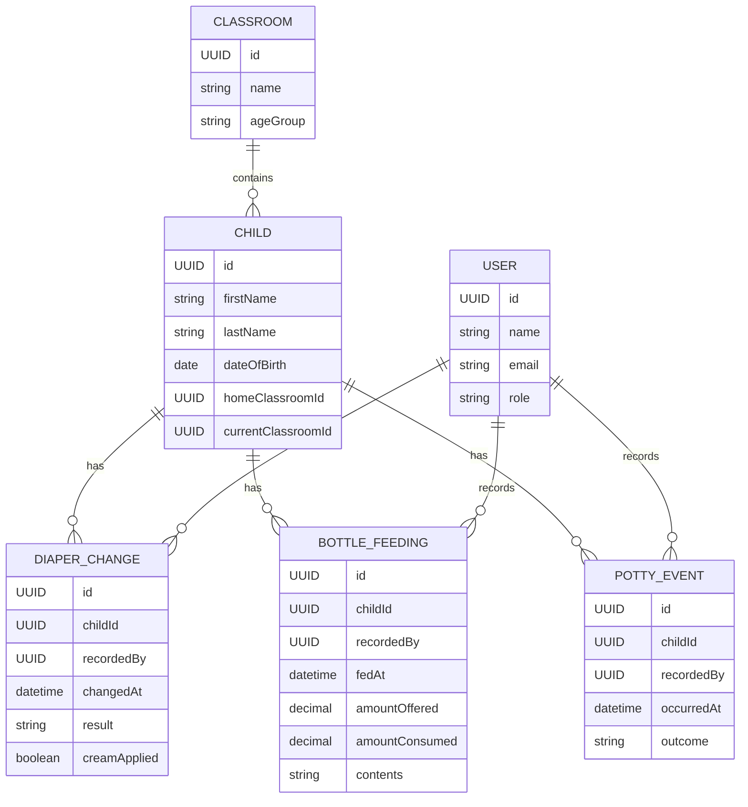

# Data Model

```mermaid
erDiagram
    USER {
        UUID id
        string name
        string email
        string role
    }

    CHILD {
        UUID id
        string firstName
        string lastName
        date dateOfBirth
        UUID homeClassroomId
        UUID currentClassroomId
    }

    CLASSROOM {
        UUID id
        string name
        string ageGroup
    }

    DIAPER_CHANGE {
        UUID id
        UUID childId
        UUID recordedBy
        datetime changedAt
        string result
        boolean creamApplied
    }

    BOTTLE_FEEDING {
        UUID id
        UUID childId
        UUID recordedBy
        datetime fedAt
        decimal amountOffered
        decimal amountConsumed
        string contents
    }

    POTTY_EVENT {
        UUID id
        UUID childId
        UUID recordedBy
        datetime occurredAt
        string outcome
    }

    CLASSROOM ||--o{ CHILD : contains
    CHILD ||--o{ DIAPER_CHANGE : has
    CHILD ||--o{ BOTTLE_FEEDING : has
    CHILD ||--o{ POTTY_EVENT : has
    USER ||--o{ DIAPER_CHANGE : records
    USER ||--o{ BOTTLE_FEEDING : records
    USER ||--o{ POTTY_EVENT : records
```
