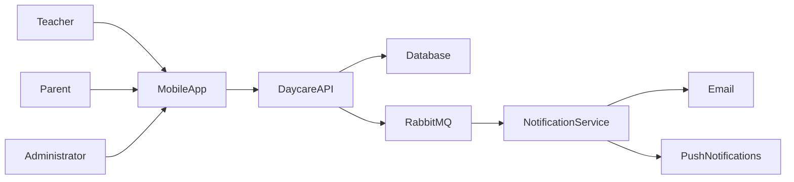

# System Architecture

## Overview

The Daycare Management System is a mobile-first application that enables teachers,
parents, and administrators to record and review childcare events.

The system consists of several independent services that communicate using REST APIs
and asynchronous messaging.

## Components

- React Native Mobile App
- Daycare API
- Notification Service
- Database
- RabbitMQ

## Users

- Teacher
- Parent
- Administrator

## High-Level Architecture

